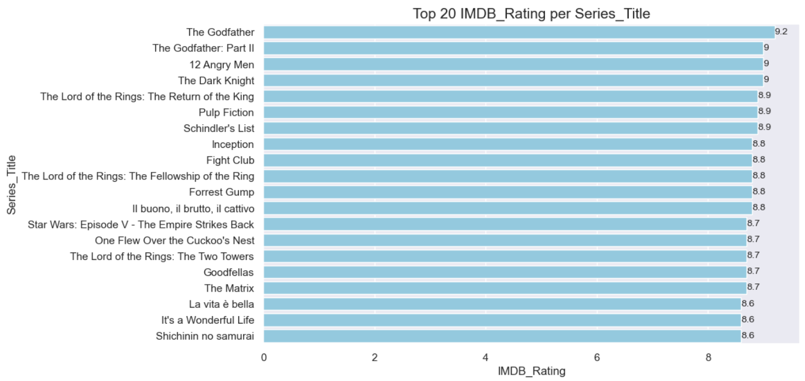
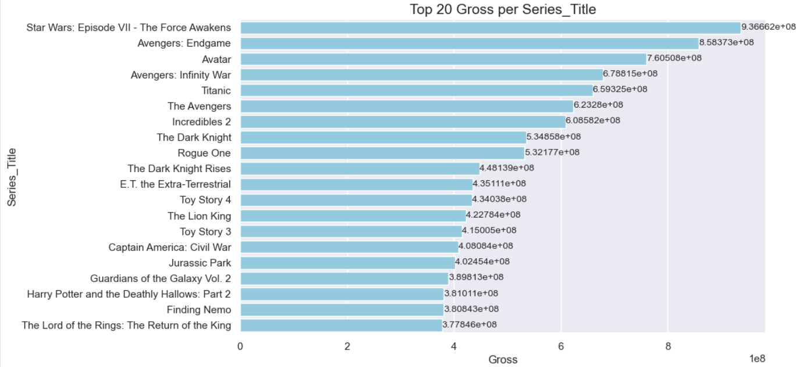
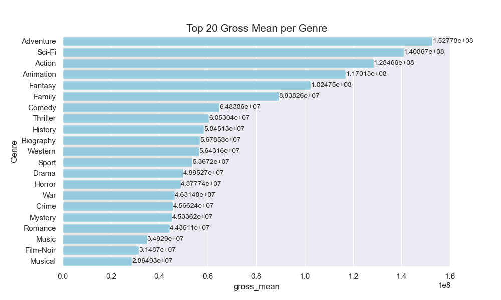
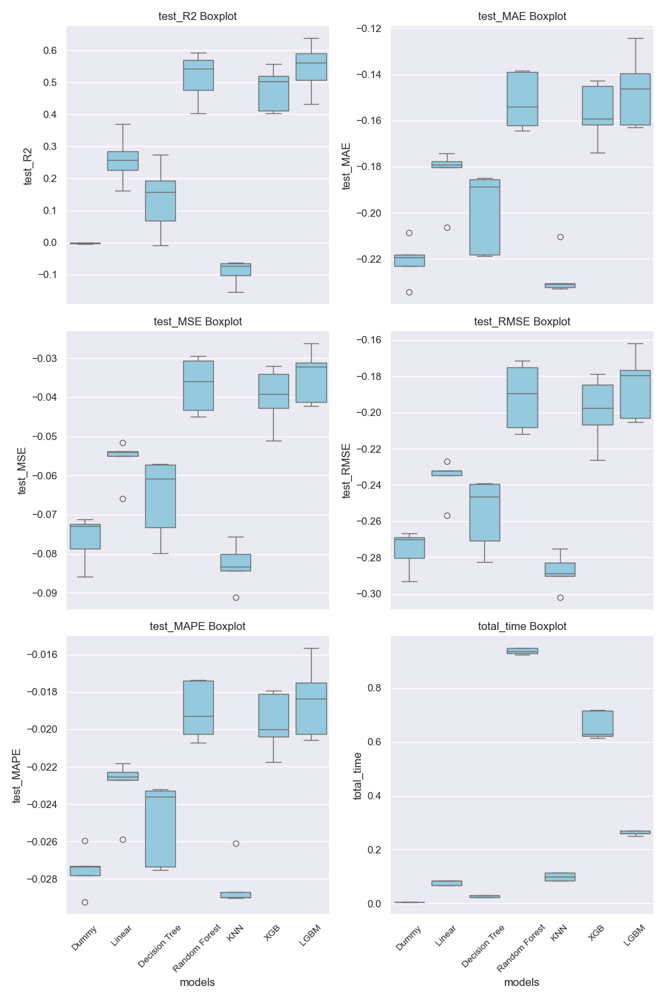

#  IMDB Movies

<!------------------------------------------------------>
## 1 - Descrição do Projeto

O projeto desenvolvido foi um desafio proposto pela Indicium Lighthouse. O desafio, conforme a descrição da própria indicium consiste em realizar uma análise em um banco de dados cinematográfico com o objetivo de orinetar qual o tipo de filme deve ser o próximo a ser desenvolvido. 

<!------------------------------------------------------>
## 2 - Entregas

As  entregas exigidas para este projeto são:
1.	Faça uma análise exploratória dos dados (EDA), demonstrando as principais características entre as variáveis e apresentando algumas hipóteses relacionadas. Seja criativo!
2.	Responda também às seguintes perguntas:
  - a.	Qual filme você recomendaria para uma pessoa que você não conhece?
  - b.	Quais são os principais fatores que estão relacionados com alta expectativa de faturamento de um filme? 
  - c.	Quais insights podem ser tirados com a coluna Overview? É possível inferir o gênero do filme a partir dessa coluna?
3.	Explique como você faria a previsão da nota do imdb a partir dos dados. Quais variáveis e/ou suas transformações você utilizou e por quê? Qual tipo de problema estamos resolvendo (regressão, classificação)? Qual modelo melhor se aproxima dos dados e quais seus prós e contras? Qual medida de performance do modelo foi escolhida e por quê?
4.	Supondo um filme com as seguintes características:
```python
   {'Series_Title': 'The Shawshank Redemption',
  	'Released_Year': '1994',
  	'Certificate': 'A',
  	'Runtime': '142 min',
  	'Genre': 'Drama',
  	'Overview': 'Two imprisoned men bond over a number of years, finding solace and eventual redemption through acts of common decency.',
  	'Meta_score': 80.0,
  	'Director': 'Frank Darabont',
  	 'Star1': 'Tim Robbins',
  	'Star2': 'Morgan Freeman',
  	'Star3': 'Bob Gunton',
  	'Star4': 'William Sadler',
  	'No_of_Votes': 2343110,
  	'Gross': '28,341,469'}
```
   Qual seria a nota do IMDB?

6.	Salve o modelo desenvolvido no formato .pkl. 

Estas foram respondidas ao decorrer dos relatórios escritos juntamente com os códigos nos arquivos `EDA.ipybn` e `Modeling.ipybn`.


<!------------------------------------------------------>
## 3 - Descrição da Database

A base de dados de treinamento contém 15 colunas. A descrição das colunas é:

- `Series_Title`: Nome do filme
- `Released_Year`: Ano de lançamento
- `Certificate`: Classificação etária
- `Runtime`: Tempo de duração
- `Genre`: Gênero
- `IMDB_Rating `: Nota do IMDB
- `Overview`: Overview do filme
- `Meta_score`: Média ponderada de todas as críticas 
- `Director`: Diretor
- `Star1`: Ator/atriz #1
- `Star2`: Ator/atriz #2
- `Star3`: Ator/atriz #3
- `Star4`: Ator/atriz #4
- `No_of_Votes`: Número de votos
- `Gross`: Faturamento


<!------------------------------------------------------>
## 4 - Pipeline de Solução

O seguinte pipeline foi utilizado, com base no framework CRISP-DM:

1. EDA
  - Definir o problema de negócio.
  - Coletar os dados e obter uma visão geral dos mesmos.
  - Explorar os dados (análise exploratória de dados)
  - Limpeza e pré-processamento de dados.
2. Modelagem
  - Comparação
    - Dividir os dados em conjuntos de treinamento e teste.
    - Comparar Modelos
  - Ajuste Fino (Fine Tunning)
    - Seleção e Ajuste de Recursos.
    - Exportar o modelo.
  - Testar
    - Teste e avaliação do modelo de produção final.
    - Concluir e interpretar os resultados do modelo.
    - Deploy.


<!------------------------------------------------------>
## 5 - Tecnologias e Ferramentas
Este projeto foi desenvolvido utilizando um conjunto de ferramentas e bibliotecas amplamente utilizadas em ciência de dados e aprendizado de máquina:

📊 Bibliotecas para Análise de Dados
- Pandas – Manipulação e análise de dados tabulares.

- NumPy – Operações matemáticas e manipulação de matrizes.

- Matplotlib and Seaborn – Criação de gráficos e visualizações exploratórias.

🤖 Machine Learning
- Scikit-learn (sklearn) – Estrutura principal para aprendizado de máquina, usada para:

   - Modelos: DummyRegressor, LinearRegression, DecisionTreeRegressor, RandomForestRegressor, KNeighborsRegressor.

   - Cross-validation: KFold, cross_validate.

   - Otimização de hiperparâmetros: GridSearchCV.

- XGBoost (XGBRegressor) ​​– Algoritmo baseado em árvore focado em desempenho.

- LightGBM (LGBMRegressor) ​​– Algoritmo de aumento rápido e eficiente para grandes volumes de dados.

📦 Outras Bibliotecas de Suporte

 - Pickle – Serialização e desserialização de objetos Python, utilizada para salvar e carregar os modelos treinados.

🧪 Ambiente de Desenvolvimento
- Jupyter Notebook – Ambiente interativo para visualização de desenvolvimento, testes e análise.

- Anaconda – Gerenciador de pacotes e ambientes, usado para organizar o ambiente de desenvolvimento.

🌐 Controle de versão
- GitHub – Plataforma para controle de versão, hospedagem e documentação de projetos.

<!------------------------------------------------------>
## 6 - Principais Insights do EDA


### Título × Nota IMDB e Faturamento

#### Título × Faturamento
- A maior nota foi 9.2, e foi alcançada pelo filme The Godfather (O Poderoso Chefão)
  


#### Título × Faturamento
- O filme de maior faturamento foi Star Wars VII - The Force Awakens, arrecadando 900 Milhões de dólares e quase 100 Milhões de dólares a mais que o segundo colocado, Avengers: The Endgame
  



### Gênero × Nota IMDB e Faturamento médios

#### Gênero × Nota IMDB Média
- As notas médias do IMDB são muto próximas por gênero, indicando uma pouca influência deste como fator da nota.
  


#### Gênero × Faturamento Médio
- Os gêneros de maior faturametno são Aventura, Ficção Científica e Ação.
  



<!------------------------------------------------------>
## 7 - Principais Insights da Modelagem

### Comparando Modelos

- Os seguintes modelos foram utilizados para comparar e escolher o ideal para o problema:
  - Dummy Regressor
  - Linear Regressor
  - Decision Tree
  - Random Forest
  - KNN
  - XGB
  - LGBM
 



### Desempenho do melhor modelo ajustado
- O melhor modelo entre os testados foi o LGBM, obtendo as seguintes pontuações após o fine tunning

| Metrica   | Score    |
|-----------|----------|
| R2        | 0.54 |
| MAE       | -0.14 |
| MSE       | -0.03 |
| RMSE      | -0.18 |
| MAPE      | -0.02 |

<!------------------------------------------------------>
## 8 - Execute este projeto em sua máquina local

Para reproduzir este projeto em sua própria máquina, siga os passos abaixo:


### 1 - Clone o repositório e vá até ele

```bash
git clone https://github.com/elaragao/IMDB-Movies.git
cd IMBD-Movies
```


### 2 - Crie um ambiente virtual (opcional, mas recomendado)

```bash
python -m venv venv
source venv/bin/activate   # Linux/Mac
venv\Scripts\activate      # Windows
```


### 3 - Instale as dependências

```bash
pip install -r requirements.txt
```


### 4 - Estrutura de pastas
O projeto segue a seguinte estrutura:

```bash
├── notebooks
│   ├── EDA.ipynb         # Análise exploratória dos dados
│   ├── Modeling.ipynb    # Modelagem preditiva
├── images                # Visualizações salvas
├── datasets
│   └── desafio_indicium_imdb   # Base de dados utilizada
├── README.md
├── requirements.txt
```


### 5 - Execute os notebooks
Abra o Jupyter Notebook ou Jupyter Lab e rode os arquivos:

```bash
jupyter notebook
```

Em seguida, abra:

`notebooks/EDA.ipynb` para a análise exploratória.

`notebooks/Modeling.ipynb` para a modelagem e predição da nota do IMDB.


<!------------------------------------------------------>
## 9 - Próximos Passos

- Executar um Deploy utilizando MLFlow e Streamlit
- Automatizar o processo de transformação dos dados através de pipelines utilizando `sklearn`
